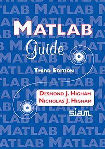
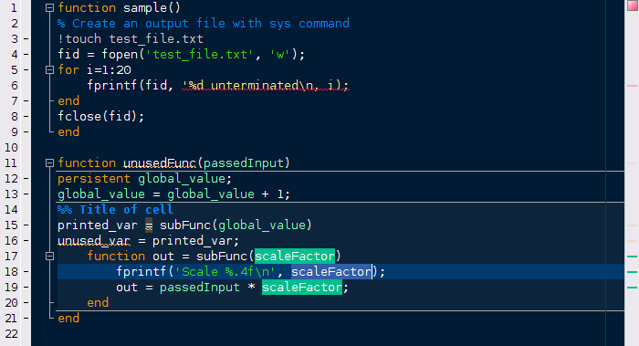

[Teoría de elementos finitos y su implementación (December, 2018)](https://github.com/carlosal1015/Finite-element-method-FEM/tree/master/2018)
===

## Estructura general del repositorio

```
├── banner.png
├── Books
│   ├── Math-Applied
│   └── MATLAB
├── Elementos_Finitos_Practica_computacional.pdf
├── matlab-guide-3ed
├── matlab-schemer
├── Notebooks
├── README.md
├── Slides
├── Week_1
└── Week_2
```

* La carpeta `matlab-guide-3ed` contiene los scripts del libro 
<p align="center">
<href="http://www.maths.manchester.ac.uk/~higham/mg/index.php">
  
</p>

* La carpeta `matlab-schemer` contiene esquemas de color tales comoc olores de resaltado variable, subrayado ondulado por errores o advertencias.
<p align="center">
<href="https://www.mathworks.com/matlabcentral/fileexchange/53862-matlab-schemer">
  
</p>

## Cuadernos Jupyter (MATLAB | C++)

* [Introduction_to_MATLAB](https://nbviewer.jupyter.org/github/carlosal1015/Finite-element-method-FEM/blob/master/2018/Notebooks/Introduction_to_MATLAB.ipynb)
* [Functions_in_MATLAB_I](https://nbviewer.jupyter.org/github/carlosal1015/Finite-element-method-FEM/blob/master/2018/Notebooks/Functions_in_MATLAB_I.ipynb)
* [Functions_in_MATLAB_II](https://nbviewer.jupyter.org/github/carlosal1015/Finite-element-method-FEM/blob/master/2018/Notebooks/Functions_in_MATLAB_II.ipynb)


## Diapositivas

### Semana 1
* [Revisión de álgebra lineal, 10/12/2018](https://github.com/carlosal1015/Finite-element-method-FEM/blob/master/2018/Slides/Revision_Algebra_lineal_Beamer_1.pdf)
* [Aproximación lineal por tramos $1-D$ y la Proyección $L^2$](https://github.com/carlosal1015/Finite-element-method-FEM/blob/master/2018/Slides/UNALM_proy_L2_Beamer_2_v1.pdf)
* [Elementos finitos $1-D$](https://github.com/carlosal1015/Finite-element-method-FEM/blob/master/2018/Slides/UNALM_FEM_Beamer_3.pdf)
* [Problema lineal y no lineal de valor de frontera. Formulación variacional e implementación computacional](https://github.com/carlosal1015/Finite-element-method-FEM/blob/master/2018/Slides/UNALM_PVFgeneral_FEM_Beamer_4.pdf)
* [Elementos de la teoría matemática de los elementos finitos](https://github.com/carlosal1015/Finite-element-method-FEM/blob/master/2018/Slides/Teoria_Matematica_Beamer_5.pdf)

### Semana 2

* [Condiciones de Dirichlet]()