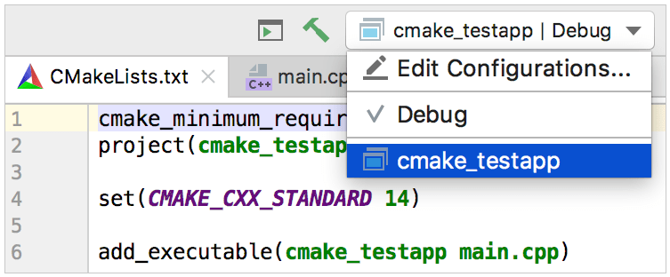
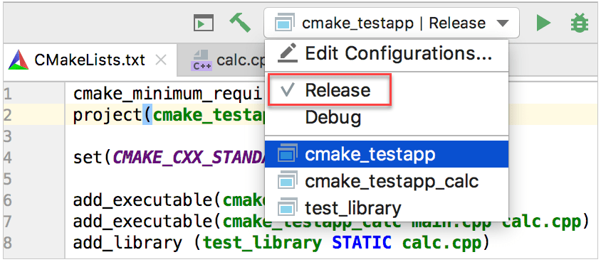

Title: Introduction on Numerical Modelling with Differential Equations
date: 2019-10-23 10:00
Modified: 2019-10-23 22:12
comments: true
slug: cpp-101
tags: cpp, linux

<!-- PELICAN_BEGIN_SUMMARY -->
In this section, we summarize the first session about introduction of C++ language. Let's go!
<!-- PELICAN_END_SUMMARY -->

C++ is a language both high level and low level, in hence, could be efficient.

This language take extern language, like `import` in Python, with help of preprocessor, we use `iostream`, `cmath`, `vector` and so on.

In a C++ program always is specified by the keyword `return`.

In C++ every program has a main function. By `UNIX` tradition, the error code zero means the action completed successfully. Some either non-zero value means false. In UNIX systems zero represent a message of exit successful.

`.cc` and `.cpp` are valid extensions. In this school we use `.cc` extension for source code and `.hh` for headers files.


### C++ version


``` cpp
// helloworld.cc
#include <iostream>
#include <string>

void print(std::string msg)
{
	std::cout << msg << std::endl;
}

int main(int argc, char** argv)
{
	std::string greeting = "Hello World";
	print(greeting);

	return 0;
}
```

In order to run this program in the terminal, execute this, its depend of your compiler, we will show with gcc, cling, clang and intel compiler.

``` sh
$ g++ -o helloWorld helloworld.cc
$ ./helloworld
```

``` sh
$ clang++ helloworld.cc -o helloworld  
$ ./helloworld
```

``` sh
$ icpc helloworld.cc
$ ./a.out
```

``` sh
$ cling
****************** CLING ******************
* Type C++ code and press enter to run it *
*             Type .q to exit             *
*******************************************
[cling]$ #include <iostream>
[cling]$ std::cout << "Hello World" << std::endl;
Hello World
[cling]$ .q
```

``` sh
$ icc --version
icc (ICC) 19.0.5.281 20190815
Copyright (C) 1985-2019 Intel Corporation.  All rights reserved.

$ icpc --version
icpc (ICC) 19.0.5.281 20190815
Copyright (C) 1985-2019 Intel Corporation.  All rights reserved.

$ ifort --version
ifort (IFORT) 19.0.5.281 20190815
Copyright (C) 1985-2019 Intel Corporation.  All rights reserved.

$ g++ --version
g++ (GCC) 9.2.0
Copyright (C) 2019 Free Software Foundation, Inc.
This is free software; see the source for copying conditions.  There is NO
warranty; not even for MERCHANTABILITY or FITNESS FOR A PARTICULAR PURPOSE.

$ clang++ --version
clang version 9.0.0 (tags/RELEASE_900/final)
Target: x86_64-pc-linux-gnu
Thread model: posix
InstalledDir: /usr/bin

$ cling --version
0.6
```

Ahora veamos usando CMake :smile:

# Quick CMake Tutorial

¿Pero qué es CMake?
CMake es un sistema de metaconstrucción que emplea scripts llamados CMakeLists para generar archivos de construcción para una entorno específico (por ejemeplo, makefiles en máquinas UNIX). Cuando crea un nuevo projecto CMake en CLion, un `CMakeLists.txt` es automáticamente generado la raíz del proyecto.

Empecemos creando un nuevo projecto CMake. Para esto vaya a **Archivo | Nuevo proyecto** y escoja **ejecutable en C++**. En nuestro ejemplo, el proyecto es llamado `cmake_testapp` y seleccione el lenguaje estándar *C++14*.

CMake es un sistema de metaconstrucción que emplea scripts llamados CMakeLists para generar archivos de construcción para una entorno específico (por ejemeplo, makefiles en máquinas UNIX). Cuando crea un nuevo projecto CMake en CLion, un c es automáticamente generado la raíz del proyecto.
Por defecto, tenemos el proyecto con un solo archivo `main.cpp` y el automáticamente creará en la raíz `CMakeLists.txt` conteniendo los siguientes comandos:


## 1. Basic CMake project


| Comando                 | Descripción        |
|-------------------------|--------------------|
|`cmake_minimum_required` | Especifica la mínima versión requerida por CMake.
|`project(cmake_testapp)` | Define el nombre del proyecto de acuerdo con lo que proporcionamos durante la creación del proyecto. |
|`set(CMAKE_CXX_STANDARD 14)`|Establece la variable CMAKE_CXX_STANDARD en el valor de 14, como seleccionamos al crear el proyecto.|
|`add_executable(cmake_testapp main.cpp)`| Agrega el objetivo ejecutable cmake_testapp que se construirá a partir de main.cpp. |

# 2. Crear objetivos y ejecutar / depurar configuraciones

Target es un ejecutable o una biblioteca que se creará utilizando un script CMake. Puede definir múltiples objetivos de compilación en un solo script.

Por ahora, nuestro proyecto de prueba tiene solo un objetivo de compilación, cmake_testapp. Al cargar el primer proyecto, CLion agrega automáticamente una configuración de Ejecutar/Depurar asociada con este objetivo:


Click en **Editar configuración** en el cambiador o seleccione **Correr|Editar configuraciones** del menú principal para ver los detalles. El nombre del objetivo y el nombre del ejecutable fueron tomados directamente del `CMakeLists.txt`:



Note que antes del área **antes de lanzar** de este diálogo: **Construya** está fijado como un paso antes de lanzar, por defecto. Así, podemos usar esta configuración no solo para depurar o correr nuestro objetivo, sino también para mejorar la construcción.

# 3. Agregando objetivos y recargando el proyecto

Ahora vamos a agregar otro archivo fuente `calc.cpp` y crearemos un nuevo ejecutable desde este.

Click derecho en el folder raíz en el árbol del proyecto y seleccione **Nuevo|C/C++ código fuente**. CLion espera agregar el archivo a un objetivo existente:


Dado que nuestro logro principal es crear un nuevo objetivo, limpiaremos la cajita check **agregar objetivo**. De acuerdo con esto, CLion nos notificará que el nuevo archivo actualmente no pertenece a cualquier objetivo.


Ahora, declararemos un nuevo objetivo manualmente en el `CMakeLists.txt`. Note que CLion trata los archivos **CMake scripts como códigos regulares**, así podemos usar las características del código existente como el **resaltado de sintáxis**, **autocompletado** y **navegación**.


Cuando hacemos cambios en `CMakeLists.txt`, CLion necesita recargar este con el fin de actualizar la estructura del proyecto.


Podemos recargar el proyecto una vez (**recargar cambios**) o habilitar automáticamente para dejar que CLion silenciosamente aplique todos los cambios en `CMakeLists.txt`. La opción para habilitar/deshabilitar la auto recarga está también disponible en **Configuración/Preferencias|Construir,Ejecutar,Desarrollo|CMake**.

Después de recargar el proyecto, CLion añade a la configuración Correr/Depurar para el nuevo objetivo:


## Objetivos librería

Hasta este punto, los objetivos fueron agregados siendo ejecutables, y usamos `add_executable` para declararlos. Para librerías objetivos, necesitamos otro comando `- add_library`. Como un ejemplo, crearemos una librería estática desde el `calc.cpp` código fuente:

``` sh
add_library (test_library STATIC calc.cpp)
```

Así también para los ejecutables, CLion añade a la configuración Correr/Depurar para la librería objetivo después de recargar el proyecto:


Sin embargo, esta es una configuración no ejecutable, así que si intentamos correrlo o depurarlo, obtendremos un mensaje de error *Executable not specified*.

Para obtener el archivo librería, necesitamos construir el objetivo **test_library**. Para esto, podemos cambiar la configuración correspondiente y oprimir el martillo, o llamar **Construir|Construir "test_library"**. El archivo `libtest_library.a` aparecerá en la carpeta `cmake-build-debug`.

# 4. Tipos de construcción y perfiles CMake

Todas las configuraciones Correr/Depurar por las lejanas configuraciones *Depurar*, el cual es el tipo de construcción por defecto del perfil CMake que fue automáticamente configurada para nuestro proyecto. El **perfil CMake** es un conjunto de opciones para el proyecto construir. Este especifica una cadena de herramientas, el tipo de construcción, las banderas CMake, la ruta para almacenar los artefactos de construcción, *hacer* opciones de construcción y variables de entorno.

Por ejemplo, para separar las construcciones de *Depurar* y de *lanzamiento*, necesitamos agregar un `+` perfil de CMake en **Configuración/Preferencias|Construir, Ejecución, Desarrollo|CMake** y fijar este tipo de construcción como **lanzamiento**.


Note que el campo **ruta de generación** que especifica la ubicación de los resultados de construcción. Las carpetas por defecto son `cmake-build-debug` para los perfiles de depurar y `cmake-build-release` para los perfiles de lanzamiento. Siempre puede fijar otras ubicaciones de tu elección.

Ahora el cambiador configuración Correr/Depurar muestra dos perfiles disponibles:



Cambiando las configuraciones o perfiles de CMake podrían afectar las definiciones del preprocesador usadas mientras resuelve el código. Por ejemplo, cuando existen banderas separadas para construir depurar y lanzamiento, o cuando existen algunas variables que podrían tomar diferentes valores dependiendo en el tipo de construcción. Esto es llamado contexto de resolución.

Contexto de resolución define cómo CLion desempeña el resaltado de sintáxis y otras características del código como Encontrar usos, refactorización y completado de código. Cuando cambia entre configuraciones, el contexto de resolución para el archivo actual es cambiado automáticamente. También, puede seleccionarlo manualmente en el cambiador de contexto (**<Seleccione automáticamente>** restaura automáticamente la selección)

# 5. Agregar directorios incluidos

Para poder usar cabezeras adicionales ubicados en directorios separados, necesitamos agregarlos a todos los objetivos o a algunos específicos.


	In [1]: import numpy as np

	In [2]: from memview_bench_v1 import pairwise

	In [3]: X = np.random.random((500, 3))

	In [4]: timeit pairwise(X)
	1 loops, best of 3: 6.51 s per loop

It takes nearly seven seconds to compute 250,000 distances.  This is much
too slow.
<!-- This is a comment -->
